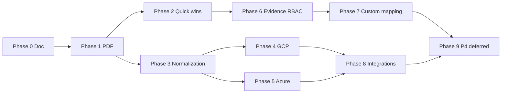

# Implementation pipeline

Ordered backlog from the direction-folder audit (`436d5b71`) and [enterprise-readiness.md](./enterprise-readiness.md). Use this doc to drive **continuous agent runs**: each run picks the next unchecked item, implements it fully (with tests), commits, and updates the checklist.

**Last updated:** 2026-07-02

## Executive summary

| Scope | Done | Notes |
|-------|------|-------|
| **Phase-one enterprise batch** (direction `TODO`, pre-audit) | ~95% | Shipped 2026-06-26; documented in `enterprise-readiness.md` |
| **Pipeline phases 0–9** (post-audit backlog) | **2 / 10 phases** (~20%) | Phase 0 doc + Phase 1 PDF only |
| **Direction README specs wholesale** | **No** | Strategy/roadmap docs remain largely aspirational; only incremental slices shipped |

**Honest answer:** The `direction/` folder READMEs were **not** wholesale-implemented. Phase-one enterprise work was already done before the audit. Since the audit, only the pipeline doc (Phase 0) and PDF graded status (Phase 1) landed. **Most backlog remains** — start at Phase 2.

**Next run:** Phase 2 (direction README gaps refresh + second virtualized table) unless `direction/` is unavailable locally — then Phase 3 or Phase 4.1.

---

## Status legend

- `[x]` **Done** — merged with commit/evidence cited inline
- `[~]` **Partial** — started or phase-one only; sub-bullets say what's left
- `[ ]` **Not started**

---

## Master checklist — direction audit (`436d5b71`)

Maps every audit finding to status. Organized by pipeline phase.

### Pre-pipeline — phase-one enterprise (direction `TODO`, shipped before audit)

These were marked complete in `direction/TODO_Veritrail_Prioritized.txt` and verified in audit. Superseded by `docs/enterprise-readiness.md`.

- [x] External evidence pipeline (registry, lifecycle, exports) — `EvidenceSource`/`EvidenceArtifact` models, `ControlEvidenceDrawer`
- [x] S3 artifact storage + presigned downloads — `EVIDENCE_ARTIFACTS_S3_URI`
- [x] ClamAV scan + upload quarantine mode — `EVIDENCE_UPLOAD_QUARANTINE_ENABLED`, `docs/external-evidence.md`
- [x] Evidence vault (Object Lock) for finalized packs — `docs/evidence-vault.md`
- [x] SHA-256 checksums in API and audit exports
- [x] `GET /v1/findings/summary` server-side aggregations
- [x] Findings infinite scroll + `@tanstack/react-virtual` group list — `VirtualizedFindingsGroups.tsx`
- [x] Auditor scoped export link API + Workspace UI — `AuditorScopedExportPanel`
- [x] Custom evidence categories in org settings — `org.settings.custom_evidence_categories`
- [x] `policy_ref` on evidence artifacts — migration 0074
- [x] MDM registry category (`mdm_endpoint`) + intake wizard — registry only, no live API
- [x] SDLC depth: `sdlc_evidence.json` + `sdlc_insights` composite
- [x] `access_review_summary.json` in audit pack — Entra/GWS sync
- [x] Jira/Linear remediation tickets on findings
- [x] Wiz/Tenable/Qualys scanner API phase-one — creds + manual sync, no auto-import
- [x] GCP phase-one collectors — `logging_audit.py`, `compute.py` only
- [x] Azure phase-one collectors — `defender.py`, `storage.py` only
- [x] AWS baseline collectors (core product)
- [x] Graded control status model (`fail` / `at_risk` / `pass` / `no_data`) — UI + `control_status.py`
- [x] `CompliancePageHeader` on Compliance, Findings, Workspace, Accounts, Integrations, History, Dashboard
- [x] Trust Center public posture page
- [x] Cross-account coverage auto-verification — `cross_account_coverage` in composite controls
- [x] Absence-gap CTAs + external-only control rule — `AbsenceGapCallout`
- [x] `docs/enterprise-readiness.md` living backlog — `cae28e51` era docs

---

### Phase 0 — Pipeline bootstrap

- [x] Create `docs/implementation-pipeline.md` — `cae28e51`
- [x] Map all direction audit items to phases 0–9 — `cae28e51`
- [x] Document parallel vs sequential rules — `cae28e51`
- [x] Continuous-run checklist for agents — `cae28e51`

---

### Phase 1 — PDF graded status (compliance-status-model Phase 5)

- [x] `at_risk` status pill in PDF (not defaulting to No Data) — `7a1a0d29`, `pdf_report.py`
- [x] Pass-rate rollups include `at_risk` in evaluated count — `7a1a0d29`
- [x] Priority Review section lists fail + at_risk controls — `7a1a0d29`, `_draw_top_controls`
- [x] Exception Register: per-control severity columns + oldest finding age + approved exceptions — `7a1a0d29`
- [x] Tests for at_risk PDF generation and review ordering — `7a1a0d29`, `test_pdf_report.py`
- [x] Mark Phase 5 done in `docs/compliance-status-model-roadmap.md` — `cae28e51`

---

### Phase 2 — Docs refresh + UI quick wins

- [ ] Refresh `direction/README_Veritrail_Product_and_Market.md` "Current gaps" to match `enterprise-readiness.md` deferred table
- [ ] Delete or archive superseded `direction/TODO_Veritrail_Prioritized.txt` locally (gitignored; not in repo)
- [ ] Extend `@tanstack/react-virtual` to Controls composite list **or** Accounts cloud table
- [ ] Verify no regression on Findings infinite scroll after virtualization change

---

### Phase 3 — Multi-cloud normalization phase-two

Audit item: *"Unified coverage model across AWS/GCP/Azure beyond current `cloud_normalization.py` + composite mapping."*

- [ ] `GET /v1/integrations/cloud-accounts` returns consistent `open_findings_count` per row
- [ ] `GET /v1/integrations/cloud-coverage` aggregates match `GET /v1/findings/summary` totals (parity test)
- [ ] Accounts page GCP/Azure overview cards match AWS card parity — `web/src/pages/Accounts.tsx`
- [ ] Update `docs/multi-cloud-collectors.md` for phase-two normalization behavior

---

### Phase 4 — GCP Release 3 collectors

Audit item: *"Missing CAI, SCC, OS Config vuln; only logging audit + compute today."*

Current collectors: `api/app/collectors/gcp/logging_audit.py`, `compute.py`.

#### 4.1 — OS Config vulnerability reports

- [ ] Collector `api/app/collectors/gcp/osconfig_vuln.py` persists normalized rows
- [ ] Model + Alembic migration for OS Config vuln data
- [ ] Check `gcp.osconfig.vuln_report_present` registered in `run_gcp_scan`
- [ ] Mapped to composite in `composite_controls.json`
- [ ] Tests with mocked GCP HTTP — `test_gcp_collectors.py`

#### 4.2 — Security Command Center

- [ ] Collector `api/app/collectors/gcp/security_command_center.py`
- [ ] Model + migration for SCC findings summary
- [ ] Check registered in `run_gcp_scan`
- [ ] Mapped to composite in `composite_controls.json`
- [ ] Tests with mocked GCP HTTP

#### 4.3 — Cloud Asset Inventory

- [ ] Collector `api/app/collectors/gcp/cloud_asset_inventory.py`
- [ ] Model + migration for CAI resource exposure
- [ ] Check registered in `run_gcp_scan`
- [ ] Mapped to composite in `composite_controls.json`
- [ ] Tests with mocked GCP HTTP

#### 4.4 — GCP onboarding polish (from engineering README)

- [ ] Organization-level onboarding flow documented
- [ ] Setup guide + Terraform snippet for GCP connection
- [ ] Test-connection detects missing permissions with degraded-check messaging

---

### Phase 5 — Azure Release 4 collectors

Audit item: *"Missing Resource Graph, Activity Log, Entra/RBAC deep checks, Azure Policy; only Defender + storage today."*

Current collectors: `api/app/collectors/azure/defender.py`, `storage.py`.

#### 5.1 — Azure Resource Graph

- [ ] Collector `api/app/collectors/azure/resource_graph.py`
- [ ] Model + migration for inventory baseline
- [ ] Check registered in `run_azure_scan`
- [ ] Mapped to composite in `composite_controls.json`
- [ ] Tests with mocked Azure HTTP

#### 5.2 — Activity Log / diagnostic settings

- [ ] Collector `api/app/collectors/azure/activity_log.py`
- [ ] Model + migration for management-plane actions
- [ ] Check registered in `run_azure_scan`
- [ ] Mapped to composite in `composite_controls.json`
- [ ] Tests with mocked Azure HTTP

#### 5.3 — Entra / Azure RBAC deep checks

- [ ] Collector `api/app/collectors/azure/entra_rbac.py`
- [ ] Model + migration for privileged role assignments
- [ ] Check registered in `run_azure_scan`
- [ ] Mapped to composite in `composite_controls.json`
- [ ] Tests with mocked Azure HTTP

#### 5.4 — Azure Policy compliance

- [ ] Collector `api/app/collectors/azure/policy_compliance.py`
- [ ] Model + migration for policy compliance state
- [ ] Check registered in `run_azure_scan`
- [ ] Mapped to composite in `composite_controls.json`
- [ ] Tests with mocked Azure HTTP

#### 5.5 — Azure onboarding polish

- [ ] Subscription-level onboarding documented with exact app registration permissions
- [ ] Test-connection detects missing permissions with degraded-check messaging
- [ ] Management group support (stretch — can defer within phase)

---

### Phase 6 — Granular evidence RBAC

Audit item: *"Contributor / reviewer / auditor-viewer roles beyond coarse org roles."*

- [ ] Role matrix documented: contributor (upload), reviewer (accept/reject), auditor-viewer (read-only pack)
- [ ] `evidence_role` enum or equivalent on org team model + Alembic migration
- [ ] API enforces role on evidence mutate routes (403 on unauthorized)
- [ ] API enforces role on evidence read routes for auditor-viewer scope
- [ ] UI hides upload/review/accept actions based on role — `Controls.tsx`, evidence slide-over
- [ ] Tests for 403 on unauthorized evidence actions

---

### Phase 7 — Custom control mapping (per-control)

Audit item: *"Custom evidence categories shipped; per-control mapping still partial."*

- [x] Custom evidence categories in org settings — phase-one complete
- [ ] `org_control_mappings` table + Alembic migration
- [ ] API: org can add/remove `check_ids` for a `control_id` without forking global mappings
- [ ] Pack export respects org overrides — `seed_controls.py`, `check_controls.py`
- [ ] Composite status respects org overrides
- [ ] Falls back to global `control_mappings.json` when no override
- [ ] Settings UI for per-control mapping (Workspace or Compliance)

---

### Phase 8 — Release 5 integrations

Audit item: *"Snyk/Orca/Aikido/Splunk/Datadog/SIEM; Okta live sync; scanner auto-import."*

Pick **one vendor per agent run**.

#### Scanners (API connect + sync + audit-pack export)

- [ ] Snyk integration — connect, verify, sync, export JSON
- [ ] Orca integration — connect, verify, sync, export JSON
- [ ] Aikido integration — connect, verify, sync, export JSON

#### SIEM / monitoring

- [ ] Splunk integration — connect, verify, sync, export JSON
- [ ] Datadog integration — connect, verify, sync, export JSON
- [ ] Generic SIEM export adapter (Elastic / Sentinel — pick one)

#### Identity

- [ ] Okta live sync (parallel to Entra/GWS) — `identity_provider.py` extension
- [ ] Okta access review evidence in audit pack

#### Scanner auto-import

- [ ] Scanner API pull creates/updates findings with dedup — `scanner_sync.py`
- [ ] Documented in `docs/integrations-overview.md`

#### Ticketing (stretch within Release 5)

- [~] Jira remediation tickets — phase-one shipped
- [~] Linear remediation tickets — phase-one shipped
- [ ] GitHub Issues remediation integration
- [ ] Azure Boards remediation integration

---

### Phase 9 — Deferred P4 (explicitly out of scope until Phases 1–8)

From `enterprise-readiness.md` and direction `TODO`. **Do not start until Phase 8 complete.**

- [ ] AI evidence-pack summary — reuse findings triage infra; wire pack-level narrative in export
- [ ] Full generic SOC 2 questionnaire — large content + UI surface
- [ ] HR / training compliance modules
- [ ] Vendor-risk management modules
- [ ] Advanced custom frameworks — beyond per-control mapping (Phase 7)
- [ ] Live Intune API collector — beyond registry + upload path
- [ ] Live Jamf API collector — beyond registry + upload path
- [ ] Live Okta API collector — beyond access-review export summary
- [ ] Auditor approval UI for vault objects — presign API exists; end-to-end share records minimal
- [ ] Separate `EvidenceRequirement` / `ControlCoverage` DB tables — logic lives in composites + `category_evidence_coverage.py` today

---

### Partial — engineering strategy README (ongoing)

Items from `direction/README_Veritrail_Engineering_and_Evidence_Strategy.md` not fully captured above.

#### Release 1 — Evidence correctness (largely done)

- [x] Source-of-evidence registry
- [x] External evidence lifecycle states (draft → accepted → expired)
- [x] External evidence in exports / audit packs
- [x] Reviewer approval flow
- [x] Hardened evidence file storage (S3 + ClamAV)
- [x] Status model beyond pass/fail (graded model)

#### Release 2 — UX polish (largely done)

- [x] Standardized page shell — `CompliancePageHeader`
- [x] Coverage dashboard — `EvidenceCoverageDashboard`
- [x] Evidence drawer across controls/findings
- [x] Empty states and gap prompts — absence-gap CTAs
- [~] Source-specific setup guides — AWS/GCP/Azure partial; not all integrations documented

#### Release 3 — GCP baseline

- [~] Cloud Audit Logs collector — `logging_audit.py` shipped
- [~] IAM/service account checks — partial via `compute.py`
- [ ] Cloud Asset Inventory collector — Phase 4.3
- [ ] Security Command Center collector — Phase 4.2
- [ ] OS Config vulnerability reports — Phase 4.1
- [ ] Normalize all GCP findings into unified evidence model — Phase 3 dependency

#### Release 4 — Azure baseline

- [~] Microsoft Defender for Cloud — `defender.py` shipped
- [~] Storage checks — `storage.py` shipped
- [ ] Azure Resource Graph — Phase 5.1
- [ ] Activity Log collector — Phase 5.2
- [ ] Entra/RBAC evidence — Phase 5.3
- [ ] Azure Policy compliance — Phase 5.4

#### Release 5 — Deeper integrations

- [~] Tenable / Qualys / Wiz scanner API — phase-one creds, no auto-import
- [ ] Orca / Snyk / Aikido — Phase 8
- [ ] Datadog / Splunk / SIEM — Phase 8
- [~] Entra / Google Workspace sync — phase-one shipped
- [ ] Okta live sync — Phase 8
- [~] Intune / Jamf registry + upload — no live API
- [ ] Kandji MDM support

---

## Infra / docs (outside pipeline phases — shipped separately)

Not direction-product features; landed in recent commits.

- [x] Prod compose consolidation for Hetzner-only deploy — `8cb7c716`, `compose.prod.yml`
- [x] Remove redundant compose overlays (`compose.hetzner-rolesanywhere.yml`, `compose.iap.yml`) — `8cb7c716`
- [x] Bootstrap scripts simplified for Hetzner path — `8cb7c716`, `2831aa01`
- [x] Vault client cert renewal automation — `2831aa01`, `scripts/renew-vault-client-cert.sh`
- [x] Vault client cert TTL default 90 days — `007125ce`
- [x] SEO files publicly served (robots.txt, sitemap.xml, llms.txt) — `4a96b37f`
- [x] Stale docs and redundant scripts cleanup — `d303570a`
- [x] fail2ban filter fix for production nginx logs — `92d45fc6`
- [x] Hetzner Vault Roles Anywhere runbook — `docs/hetzner-vault-rolesanywhere.md`
- [x] `d` alias for routine prod redeploys — `9eecf594`

---

## Principles

1. **Quick wins first** — docs refresh, PDF parity, small API gaps before large integrations.
2. **Incremental collectors** — one GCP/Azure check per run when possible; wire collector → check → composite → test.
3. **Dependencies first** — normalization APIs before UI that consumes them; RBAC schema before route guards.
4. **Parallel when safe** — disjoint files (e.g. GCP collector vs Azure collector) can run in parallel agents; shared files (`composite_controls.json`) need sequencing.

---

## Phase map

| Phase | Theme | Size | Depends on | Direction audit items |
|-------|--------|------|------------|----------------------|
| **0** | Pipeline doc (this file) | S | — | Meta |
| **1** | PDF graded status (Phase 5) | S | — | PDF graded status |
| **2** | Docs refresh + UI quick wins | S | — | Gaps README refresh; virtualized tables |
| **3** | Multi-cloud normalization polish | M | Phase 1 shipped | Multi-cloud normalization phase-two |
| **4** | GCP Release 3 collectors | L | Phase 3 | CAI, SCC, OS Config vuln |
| **5** | Azure Release 4 collectors | L | Phase 3 | Resource Graph, Activity Log, Entra/RBAC, Policy |
| **6** | Evidence RBAC groundwork | M | — | Contributor / reviewer / auditor-viewer |
| **7** | Custom control mapping | M | Phase 6 optional | Per-control org mapping |
| **8** | Release 5 integrations | XL | Phases 4–5 | Snyk/Orca/Aikido/Splunk/Datadog/SIEM; Okta live; scanner auto-import |
| **9** | Deferred P4 | XL | Phases 1–8 | AI pack summary, full SOC 2 questionnaire, HR/training/vendor-risk, advanced frameworks, live Intune/Jamf/Okta APIs |

---

## Parallel vs sequential summary

**Safe parallel pairs:** Phase 4 + Phase 5; Phase 2 + Phase 3; Phase 6 + Phase 4 (watch migrations).

**Must be sequential:** Phase 3 before broad collector UI; Phase 6 before Phase 7 mapping permissions; Phase 8 scanner auto-import after baseline scanner registry.

---

## Continuous run checklist (copy-paste for PRs)

### Phase 0–1 — complete

- [x] Create `docs/implementation-pipeline.md` — `cae28e51`
- [x] PDF graded status: at_risk pill, rollups, priority review, exception register — `7a1a0d29`
- [x] `test_pdf_report.py` at_risk coverage — `7a1a0d29`

### Phase 2 — **start here**

- [ ] Refresh direction README "Current gaps" (when `direction/` exists locally)
- [ ] Extend virtualized table to Controls or Accounts page
- [ ] Update checklist in this file

### Phase 3

- [ ] Cloud-accounts `open_findings_count` per row
- [ ] Cloud-coverage totals parity test
- [ ] Accounts GCP/Azure overview parity
- [ ] `multi-cloud-collectors.md` phase-two docs

### Phase 4 — GCP (one collector per run)

- [ ] OS Config vulnerability reports collector + check + tests
- [ ] Security Command Center collector + check + tests
- [ ] Cloud Asset Inventory collector + check + tests

### Phase 5 — Azure (one collector per run)

- [ ] Resource Graph baseline
- [ ] Activity Log / diagnostic settings
- [ ] Entra RBAC deep checks
- [ ] Azure Policy compliance

### Phase 6–8

- [ ] Evidence RBAC role matrix + API guards + UI + tests
- [ ] Per-control org mapping table + API + UI
- [ ] Release 5: pick one vendor (Snyk / Orca / Aikido / Splunk / Datadog / SIEM)
- [ ] Okta live sync
- [ ] Scanner auto-import

### Phase 9 — P4 deferred (one per run, after Phase 8)

- [ ] AI pack summary OR full SOC2 questionnaire OR HR/training/vendor-risk OR live MDM APIs
