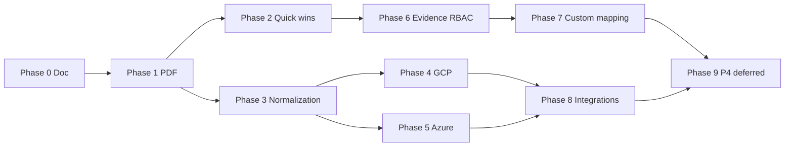

# Implementation pipeline

Ordered backlog from the direction-folder audit (`436d5b71`) and [enterprise-readiness.md](./enterprise-readiness.md). Use this doc to drive **continuous agent runs**: each run picks the next unchecked item, implements it fully (with tests), commits, and updates the checklist.

**Last updated:** 2026-07-02 (Phase 0 + Phase 1)

## Principles

1. **Quick wins first** — docs refresh, PDF parity, small API gaps before large integrations.
2. **Incremental collectors** — one GCP/Azure check per run when possible; wire collector → check → composite → test.
3. **Dependencies first** — normalization APIs before UI that consumes them; RBAC schema before route guards.
4. **Parallel when safe** — disjoint files (e.g. GCP collector vs Azure collector) can run in parallel agents; shared files (composite_controls.json) need sequencing.

## Phase map

| Phase | Theme | Size | Depends on | Direction audit items |
|-------|--------|------|------------|----------------------|
| **0** | Pipeline doc (this file) | S | — | Meta |
| **1** | PDF graded status (Phase 5) | S | — | PDF graded status |
| **2** | Docs refresh + UI quick wins | S | — | Gaps README refresh; virtualized tables |
| **3** | Multi-cloud normalization polish | M | Phase 1 shipped | Multi-cloud normalization phase-two |
| **4** | GCP Release 3 collectors | L | Phase 3 | CAI, SCC, OS Config vuln |
| **5** | Azure Release 4 collectors | L | Phase 3 | Resource Graph, Activity Log, Entra/RBAC, Policy |
| **6** | Evidence RBAC groundwork | M | — | Contributor / reviewer / auditor-viewer |
| **7** | Custom control mapping | M | Phase 6 optional | Per-control org mapping |
| **8** | Release 5 integrations | XL | Phases 4–5 | Snyk/Orca/Aikido/Splunk/Datadog/SIEM; Okta live; scanner auto-import |
| **9** | Deferred P4 | XL | Phases 1–8 | AI pack summary, full SOC 2 questionnaire, HR/training/vendor-risk, advanced frameworks, live Intune/Jamf/Okta APIs |

---

## Phase 0 — Pipeline bootstrap

**Scope:** Create this document; align on ordering.

**Files:** `docs/implementation-pipeline.md`

**Acceptance criteria:**
- [x] All direction audit items mapped to a phase
- [x] Parallel vs sequential notes per phase
- [x] Checklist for continuous runs

**Size:** S

---

## Phase 1 — PDF graded status (compliance-status-model Phase 5)

**Scope:** Audit package PDF mirrors app graded model (`pass` / `fail` / `at_risk` / `no_data`).

**Files:**
- `api/app/services/pdf_report.py`
- `api/tests/test_pdf_report.py`
- `docs/compliance-status-model-roadmap.md` (mark Phase 5 done)

**Acceptance criteria:**
- [x] `at_risk` status pill renders (not defaulting to No Data)
- [x] Pass-rate rollups include `at_risk` in evaluated count
- [x] Priority review section lists fail + at_risk controls with correct pills
- [x] Exception register: per-control severity columns + oldest finding age + approved exceptions
- [x] Tests cover at_risk PDF generation and review ordering

**Size:** S

**Parallel:** Independent of collector work.

---

## Phase 2 — Docs refresh + virtualized tables

**Scope:** Quick hygiene from partial/refresh backlog.

**Files:**
- `direction/README.md` (gitignored locally — refresh when present)
- `web/src/components/VirtualizedFindingsGroups.tsx` (pattern)
- Candidate pages: Controls composite list, Accounts cloud table, Integrations hub

**Acceptance criteria:**
- [ ] Direction README "Current gaps" matches `enterprise-readiness.md` deferred table
- [ ] At least one additional high-traffic table uses `@tanstack/react-virtual` (Controls or Accounts)
- [ ] No regression on Findings infinite scroll

**Size:** S

**Parallel:** Can run alongside Phase 3.

---

## Phase 3 — Multi-cloud normalization phase-two

**Scope:** Harden unified cloud APIs and posture consistency across AWS/GCP/Azure.

**Files:**
- `api/app/routes/cloud_integration.py`
- `api/app/services/cloud_accounts.py` (if extracted)
- `web/src/pages/Integrations.tsx`, `web/src/pages/Accounts.tsx`
- `docs/multi-cloud-collectors.md`

**Acceptance criteria:**
- [ ] `GET /v1/integrations/cloud-accounts` includes consistent `open_findings_count` per row
- [ ] `GET /v1/integrations/cloud-coverage` aggregates match findings API totals
- [ ] Accounts page uses unified cloud overview for GCP/Azure (parity with AWS cards)
- [ ] Docs updated for phase-two normalization behavior

**Size:** M

**Depends on:** Phase 1 (audit packs should already show graded status for multi-cloud findings).

---

## Phase 4 — GCP Release 3

**Scope:** Cloud Asset Inventory, Security Command Center, OS Config vulnerability reports.

**Files (per collector):**
- `api/app/collectors/gcp/<name>.py`
- `api/app/models/gcp_*.py` + Alembic migration
- `api/app/checks/gcp_*.py`
- `api/app/services/gcp_client.py`
- `api/data/composite_controls.json`, `api/data/control_mappings.json`
- `api/app/worker/tasks.py` (`run_gcp_scan`)
- `api/tests/test_gcp_collectors.py`, `api/tests/test_cloud_scan_progress.py`

**Suggested order (sequential within phase):**
1. OS Config vuln reports (`gcp.osconfig.vuln_report_present`) — M
2. Security Command Center findings summary — M
3. Cloud Asset Inventory resource exposure — L

**Acceptance criteria (each collector):**
- [ ] Collector persists normalized rows
- [ ] Check registered and runs in `run_gcp_scan`
- [ ] Mapped to at least one composite in `composite_controls.json`
- [ ] Tests with mocked GCP HTTP

**Size:** L (split across 3 runs)

**Parallel with Phase 5:** Yes, if different providers and no shared migration.

---

## Phase 5 — Azure Release 4

**Scope:** Resource Graph, Activity Log, Entra/RBAC deep checks, Azure Policy.

**Files (per collector):**
- `api/app/collectors/azure/<name>.py`
- `api/app/models/azure_*.py` + migration
- `api/app/checks/azure_*.py`
- `api/app/services/azure_client.py`
- `api/data/composite_controls.json`
- `api/app/worker/tasks.py` (`run_azure_scan`)

**Suggested order:**
1. Resource Graph inventory baseline — M
2. Activity Log export / diagnostic settings — M
3. Entra RBAC privileged role checks — L
4. Azure Policy compliance summary — L

**Acceptance criteria:** Same pattern as Phase 4.

**Size:** L

**Parallel with Phase 4:** Yes.

---

## Phase 6 — Granular evidence RBAC

**Scope:** Contributor / reviewer / auditor-viewer roles beyond coarse org roles.

**Files:**
- `api/app/core/rbac.py`
- `api/app/models/org_team.py` (or new `evidence_role` enum)
- `api/app/routes/controls.py` (evidence upload/review/accept)
- `api/migrations/versions/*.py`
- `web/src/pages/Controls.tsx`, evidence slide-over components

**Acceptance criteria:**
- [ ] Role matrix documented: contributor (upload), reviewer (accept/reject), auditor-viewer (read-only pack)
- [ ] API enforces role on evidence mutate vs read routes
- [ ] UI hides actions based on role
- [ ] Tests for 403 on unauthorized evidence actions

**Size:** M

---

## Phase 7 — Custom control mapping (per-control)

**Scope:** Org-level override of which checks map to which framework controls.

**Files:**
- `api/data/control_mappings.json` (seed)
- New `org_control_mappings` table + API
- `api/app/services/seed_controls.py`, `api/app/services/check_controls.py`
- Settings UI (Workspace or Compliance)

**Acceptance criteria:**
- [ ] Org can add/remove check_ids for a control_id without forking global mappings
- [ ] Pack export and composite status respect org overrides
- [ ] Falls back to global mapping when no override

**Size:** M

**Depends on:** Phase 6 optional (reviewer may own mapping edits).

---

## Phase 8 — Release 5 integrations

**Scope:** Third-party scanners, SIEM, IdP live sync, scanner auto-import.

**Files:**
- `api/app/routes/*_integration.py`
- `api/app/services/scanner_sync.py`, `api/app/models/identity_provider.py`
- New provider types: Snyk, Orca, Aikido, Splunk, Datadog
- Okta live sync (parallel to Entra/GWS)
- Scanner API pull → auto-import findings

**Acceptance criteria:**
- [ ] Each integration: connect, verify, sync, audit-pack JSON export
- [ ] Scanner auto-import creates/updates findings with dedup
- [ ] Documented in `integrations-overview.md`

**Size:** XL — **one vendor per agent run**

**Depends on:** Phases 4–5 for cloud parity context.

---

## Phase 9 — Deferred P4

**Scope:** Explicitly deferred in enterprise-readiness.

| Item | Notes |
|------|--------|
| AI evidence-pack summary | Reuse findings triage infra; wire pack-level narrative in export |
| Full SOC 2 questionnaire | Large content + UI surface |
| HR / training / vendor-risk modules | New domains |
| Advanced custom frameworks | Beyond per-control mapping |
| Live Intune / Jamf / Okta API collectors | MDM/IdP API phase-two |

**Size:** XL each — pick one per run after Phase 8.

---

## Parallel vs sequential summary

**Safe parallel pairs:** Phase 4 + Phase 5; Phase 2 + Phase 3; Phase 6 + Phase 4 (watch migrations).

**Must be sequential:** Phase 3 before broad collector UI; Phase 6 before Phase 7 mapping permissions; Phase 8 scanner auto-import after baseline scanner registry.

---

## Continuous run checklist

Copy status into PR descriptions. Mark `[x]` when merged.

### Phase 0–1 (this session)
- [x] Create `docs/implementation-pipeline.md`
- [x] PDF graded status: at_risk pill, rollups, priority review, exception register
- [x] `test_pdf_report.py` at_risk coverage

### Phase 2 — next agent (start here)
- [ ] Refresh direction README "Current gaps" (when `direction/` exists locally)
- [ ] Extend virtualized table to Controls or Accounts page
- [ ] Update checklist in this file

### Phase 3
- [ ] Cloud-accounts `open_findings_count` per row
- [ ] Cloud-coverage totals parity test
- [ ] Accounts GCP/Azure overview parity

### Phase 4 — GCP (one per run)
- [ ] OS Config vulnerability reports collector + check
- [ ] Security Command Center collector + check
- [ ] Cloud Asset Inventory collector + check

### Phase 5 — Azure (one per run)
- [ ] Resource Graph baseline
- [ ] Activity Log / diagnostic settings
- [ ] Entra RBAC deep checks
- [ ] Azure Policy compliance

### Phase 6–9
- [ ] Evidence RBAC role matrix + API guards
- [ ] Per-control org mapping table + API
- [ ] Release 5: pick one vendor (Snyk / Orca / Aikido / Splunk / Datadog / SIEM)
- [ ] Okta live sync
- [ ] Scanner auto-import
- [ ] P4: AI pack summary OR SOC2 questionnaire OR MDM live APIs (one per run)

---

## Next run for continuous pipeline

**Pick Phase 2** unless `direction/` is unavailable — then start **Phase 3** (cloud-coverage parity test) or **Phase 4.1** (GCP OS Config vuln collector).

Phase 1 (PDF graded status) is complete; audit packs now include Priority Review and Exception Register sections aligned with the in-app status model.
